# VMIX Bible Link - User Guide

A simple guide to using VMIX Bible Link for sending Bible verses to your vMix production.

---

## Table of Contents

1. [Getting Started](#getting-started)
2. [Loading Your Bible](#loading-your-bible)
3. [Setting Up vMix Connection](#setting-up-vmix-connection)
4. [Browsing Books and Chapters](#browsing-books-and-chapters)
5. [Selecting and Sending Verses](#selecting-and-sending-verses)
6. [Managing Saved Verses](#managing-saved-verses)
7. [Understanding the Status Indicator](#understanding-the-status-indicator)
8. [Window Settings](#window-settings)

---

## Getting Started

When you first open VMIX Bible Link, you'll see the navigation bar on the left side of the window. The navigation tabs are:

| Icon | Tab | Purpose |
|------|-----|---------|
| Bookmark | **Bible** | Browse books and chapters |
| Blocks | **Verses** | View and select verses from a chapter |
| Monitor | **Saved** | View and resend saved verse selections |
| Pencil | **Settings** | Configure your Bible data and vMix connection |

> The **Verses** tab will be greyed out until you select a chapter from the Bible tab.

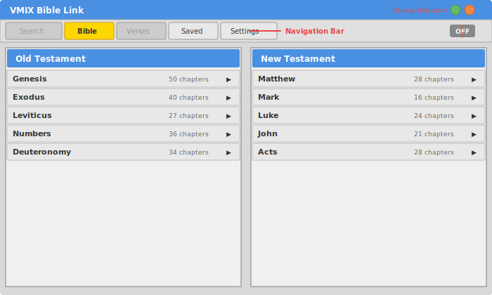

---

## Loading Your Bible

Before you can browse verses, you need to load a Bible JSON file.

1. Click the **Settings** tab in the navigation bar
2. Under **Bible Data**, click **Choose File**
3. Select your Bible JSON file from your computer
4. Wait for the upload to complete

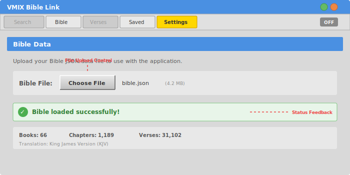

Once loaded, your Bible data is saved locally and will be available every time you open the app.

---

## Setting Up vMix Connection

To send verses to vMix, you need to configure the connection settings.

1. Click the **Settings** tab
2. Under **vMix Settings**, fill in the following:

| Field | Description | Default |
|-------|-------------|---------|
| **Host** | The IP address of your vMix computer | `127.0.0.1` (same computer) |
| **Port** | The vMix API port | `8088` |
| **Input** | Click **Fetch Inputs** to load available inputs, then select the title/text input you want to control | - |
| **Title Field** | The text field name in your vMix input for the verse reference (e.g., "Genesis 1:1") | - |
| **Body Field** | The text field name in your vMix input for the verse text | - |
| **Overlay** | Which overlay channel (1-4) to use when showing the input | `1` |

3. Click **Save** to store your settings

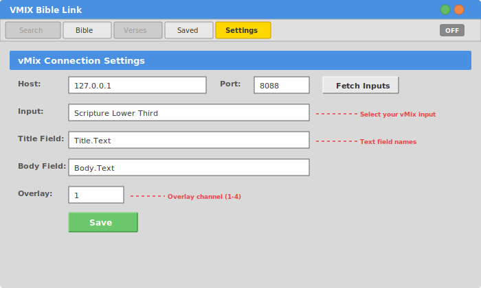

> **Tip:** Make sure vMix is running and the API is enabled before clicking **Fetch Inputs**.

---

## Browsing Books and Chapters

1. Click the **Bible** tab to see all books organized in two columns: **Old Testament** (left) and **New Testament** (right)

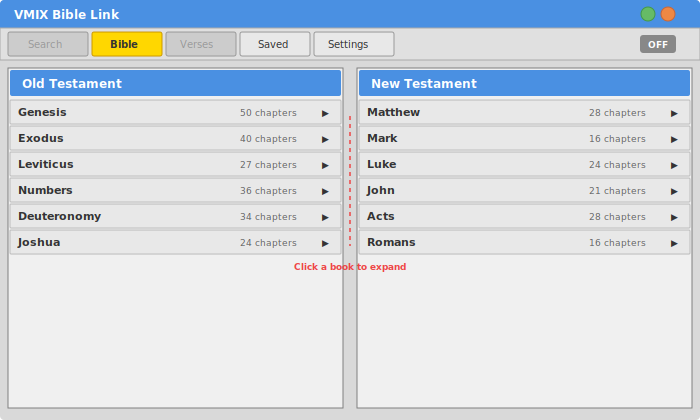

2. Click on a **book name** to expand it and reveal its chapters

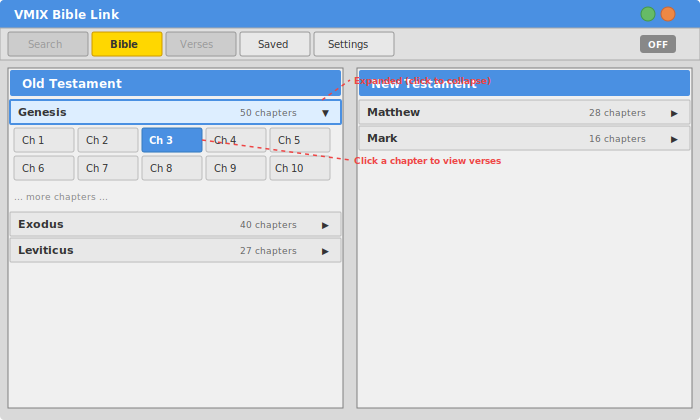

3. Click on a **chapter button** (e.g., "Ch 3") to open that chapter in the Verses view

> When you return to the Bible tab later, it will remember which books were expanded and scroll back to where you were.

---

## Selecting and Sending Verses

After clicking a chapter, the **Verses** tab opens showing all verses in a multi-column layout.

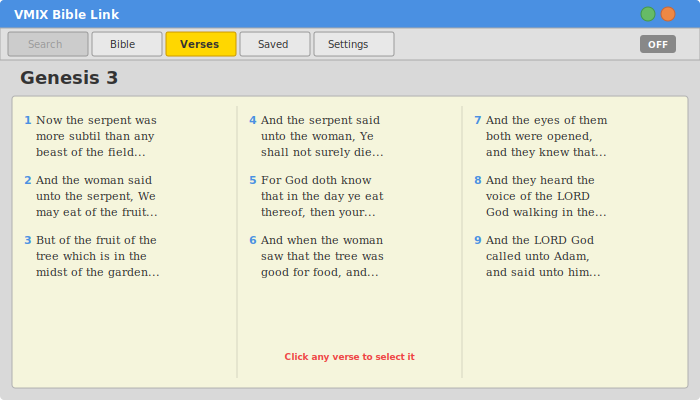

### Selecting Verses

- **Click on a verse** to select it (it will highlight in green)
- **Click again** to deselect it
- You can select **multiple verses** - they don't need to be consecutive

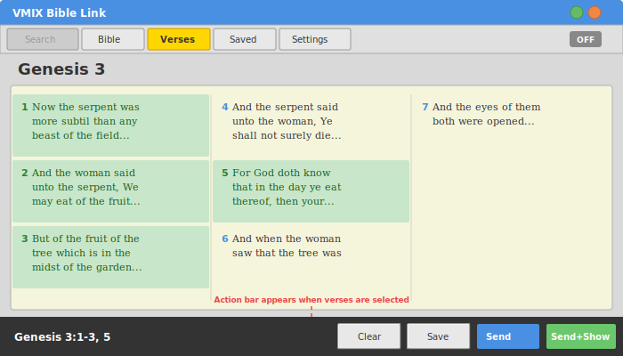

### Action Bar

Once you select one or more verses, an **action bar** appears at the bottom of the screen showing your selection reference (e.g., "Genesis 1:1-3, 5").

The action bar has these buttons:

| Button | Icon | What it does |
|--------|------|-------------|
| **Clear** | Trash can | Clears your current selection |
| **Save** | Floppy disk | Saves the selection to your Saved list |
| **Save & Send** | Paper plane | Saves and sends the verse text to vMix (without showing the overlay) |
| **Save, Send & Show** | Monitor | Saves, sends the text, AND activates the overlay in vMix |

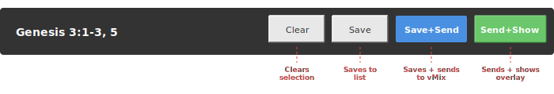

### What Gets Sent to vMix

When you send verses to vMix:

- The **Title Field** receives the formatted reference (e.g., "Genesis 1:1-3")
- The **Body Field** receives the combined verse text
- If verses are non-consecutive, they are separated by "..." in the body text

---

## Managing Saved Verses

Click the **Saved** tab to see all your previously saved verse selections, sorted with the most recent at the top.

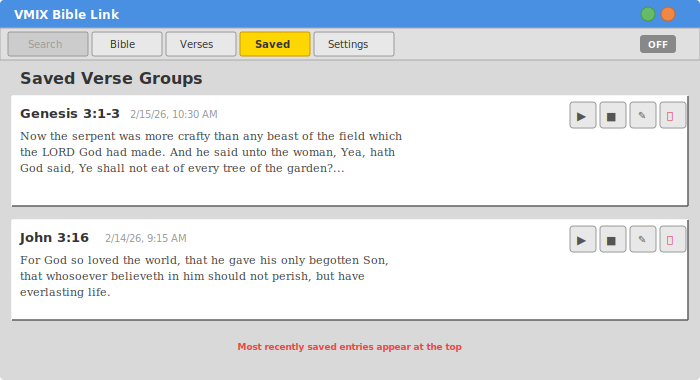

Each saved entry shows:
- The verse reference title
- The date it was saved
- The full verse text

### Actions on Saved Entries

Each entry has four buttons:

| Button | Icon | What it does |
|--------|------|-------------|
| **Send** | Paper plane | Resends the verse text to vMix |
| **Send & Show** | Monitor | Resends and activates the overlay |
| **Edit** | Pencil | Opens the entry for editing the title or body text |
| **Delete** | Trash can | Removes the entry from your saved list |

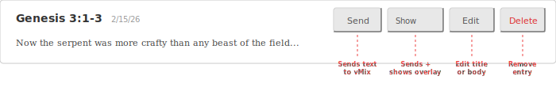

> **Tip:** Use the Send buttons on saved entries to quickly resend a verse without having to find and select it again in the Bible.

---

## Understanding the Status Indicator

In the top-right corner of the navigation bar, you'll see a small status badge that shows the current state of your vMix overlay:

| Badge | Color | Meaning |
|-------|-------|---------|
| **LIVE** | Red | Your input is currently showing on the program output |
| **PRV** | Green | Your input is in preview |
| **OFF** | Grey | Your input is not active on the configured overlay |

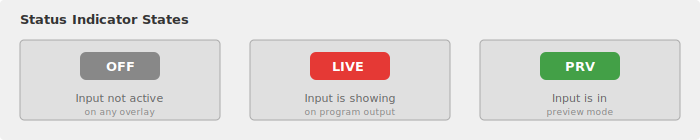

This updates automatically every 3 seconds.

---

## Window Settings

Under **Settings > Window**, you can toggle the **Transparent** checkbox to enable or disable window transparency. The app will automatically restart to apply the change.

> If you experience blurry text on certain Windows displays, try disabling transparency.

---

## Quick Start Summary

Here's the fastest way to get a verse on screen:

1. **Settings** - Load your Bible JSON and configure vMix connection
2. **Bible** - Click a book, then click a chapter
3. **Verses** - Click the verses you want
4. **Send & Show** - Click the monitor icon in the action bar

That's it! Your selected verses are now displaying in vMix.

